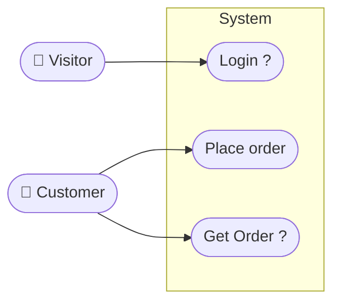
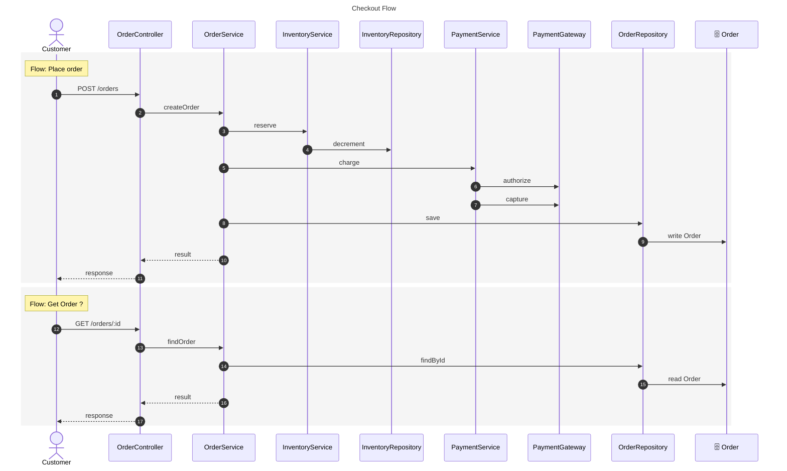
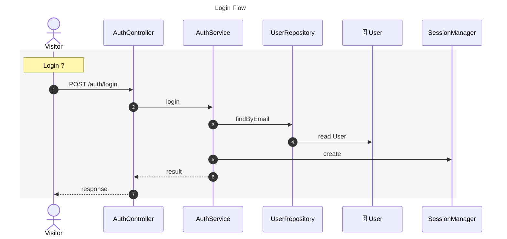

# UMLFlow

**Language-agnostic code understanding and incremental UML synchronization — for the CLI and for Claude Code.**

UMLFlow analyses a repository once, builds a compact *System Model* of its structure and behaviour, generates
Mermaid diagrams (Use Case, Sequence, ERD) from that model, and then keeps them in sync incrementally as the
code evolves — re-reading only what changed, regenerating only the diagrams that are affected, and asking an
LLM only when a question genuinely needs semantic interpretation.

> UMLFlow does not treat generated diagrams as the source of truth. **The source code is the source of truth.**
> The System Model is a cache of what the code says; diagrams are views of that model.

```
SOURCE CODE ─► change detection (git + hashes) ─► affected scope ─► parsers (tree-sitter)
           ─► System Model (components, calls, entities, flows, provenance)
           ─► Use Case / Sequence / ERD ─► Mermaid ─► .umlflow/diagrams/*.md
```

## Why

* **Token-efficient by design.** Claude never has to re-read a repository to draw or update a diagram:
  `umlflow context` summarises what is already known in a few hundred tokens, and only open *semantic
  questions* ("which actor calls `OrderController`?") need interpretation.
* **Incremental.** Content hashes + git detect what changed; a dependency-aware pipeline finds affected
  symbols and diagrams; unrelated diagrams are never touched.
* **Honest.** Every fact carries provenance: deterministic (from code), inferred (heuristics) or declared
  (by you). Uncertain facts are marked, never presented as truth. User declarations are never overwritten.
* **Language-agnostic.** Parsers sit at the edge (TypeScript/JavaScript, Python, Java, Go, SQL DDL, Prisma
  today); the model, generators and renderer never see a language-specific AST.
* **Safe.** Generated blocks are replaced in place; manual sections and everything else you write survive.
  Git hooks are installed as clearly marked managed sections next to your existing hook logic.

## Install (CLI + `/umlflow` skill)

```bash
git clone <this repo> && cd UMLFlow
./install.sh                      # builds, installs the `umlflow` CLI globally, installs ~/.claude/skills/umlflow
```

(Once published: `npm install -g umlflow && umlflow install-skill`.)

## Use it in Claude Code

Open Claude Code in any project and type:

```
/umlflow                          # initialize .umlflow/ and build Use Case + Sequence + ERD diagrams
/umlflow sequence "checkout"      # a sequence diagram scoped to a topic
/umlflow erd                      # the database ERD
/umlflow questions                # answer what code cannot tell (actors, business names) — stored forever
/umlflow diff                     # what changed architecturally, which diagrams are affected
/umlflow update                   # regenerate only affected diagrams
/umlflow hooks check              # pre-commit hook: fail when diagrams are stale
/umlflow "show me the payment architecture"
/umlflow --help
```

The skill makes Claude read UMLFlow's cached state first (`umlflow context`), delegate analysis to the CLI,
interpret only the open semantic questions with targeted context, respect your overrides, and report
inferred vs. deterministic facts honestly. Diagrams land in `.umlflow/diagrams/<name>.md` (Markdown +
Mermaid, so GitHub renders them).

## Use it from the terminal

The same engine is a plain CLI:

```bash
umlflow init -y
umlflow generate --type sequence --name checkout --about "checkout"
umlflow semantic questions
umlflow declare actor Customer --for OrderController
umlflow update && umlflow check
umlflow install-hooks --mode update
```

## What it produces

Every diagram below was generated by UMLFlow from the sample NestJS/TypeORM project in
[`tests/fixtures/repos/ts-shop`](tests/fixtures/repos/ts-shop) — the complete output (including the
`config.yaml` and `semantics.yaml` that drove it) is in [`examples/ts-shop/`](examples/ts-shop/).
Labels ending in `?` are inferred from naming; everything else is read from the code or declared.

### Use case — `/umlflow usecase`

[`examples/ts-shop/system-usecases.md`](examples/ts-shop/system-usecases.md)



### Sequence, scoped by topic — `/umlflow sequence "orders"`

[`examples/ts-shop/checkout-flow.md`](examples/ts-shop/checkout-flow.md) — scope was inferred from the word
"orders"; `Logger` is hidden via `umlflow declare ignore Logger`.



### Sequence, scoped by topic — `/umlflow sequence "login"`

[`examples/ts-shop/login-flow.md`](examples/ts-shop/login-flow.md)



### ERD — `/umlflow erd`

[`examples/ts-shop/database-erd.md`](examples/ts-shop/database-erd.md) — SQL migration tables and
`@Entity` classes describing the same tables are merged into one entity each.

```mermaid
erDiagram
  audit_log {
    BIGSERIAL id PK
    UUID actor_id FK "→ users.id"
    TEXT message
  }
  Order {
    UUID id PK
    UUID customer_id FK "→ users.id"
    NUMERIC(10,2) total "not null"
    VARCHAR(32) status
  }
  OrderItem {
    SERIAL id PK
    UUID order_id FK "→ orders.id"
    VARCHAR(64) sku "not null"
    INT quantity "not null"
  }
  User {
    UUID id PK
    VARCHAR(255) email UK "not null"
    TIMESTAMP_WITH_TIME_ZONE created_at
  }
  audit_log }o--|| User : "actor_id"
  Order }o--|| User : "customer_id"
  OrderItem }o--|| Order : "order_id"
```

The whole-system sequence diagram (every entry point) is in
[`examples/ts-shop/main-flows.md`](examples/ts-shop/main-flows.md).

## Documentation

* [Architecture](docs/architecture.md) · [Installation](docs/installation.md) · [Quick start](docs/quick-start.md)
* [CLI](docs/cli.md) · [Configuration](docs/configuration.md) · [Diagrams, definitions & overrides](docs/diagrams.md)
* [Incremental analysis, System Model & cache](docs/incremental-analysis.md)
* [Claude Code integration](docs/claude-code.md) · [Git hooks & CI](docs/git-hooks-and-ci.md)
* [Supported analysis](docs/supported-analysis.md) · [Extending (adapters, generators, renderers)](docs/extending.md)
* [Troubleshooting](docs/troubleshooting.md) · [Examples](docs/examples.md) · [Implementation plan](docs/plan.md)

## Development

```bash
npm install
npm test          # builds, then runs unit + integration tests (fixture repos, golden snapshots)
npm run build
```

MIT licensed.
