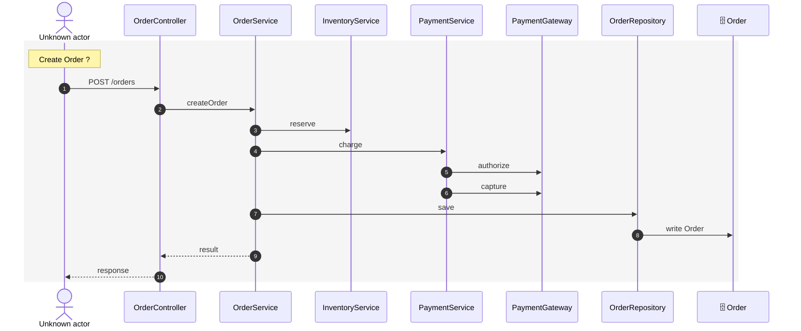

# Examples

The fixtures under `tests/fixtures/repos/` are small but realistic projects; the golden outputs in
`tests/unit/__snapshots__/golden.test.ts.snap` show exactly what UMLFlow produces for each.

## NestJS + TypeORM + SQL migrations (`ts-shop`)

```bash
umlflow init -y
umlflow generate --type sequence --name checkout --about "orders payment"
```

Sequence (excerpt):



ERD: `users`/`orders`/`order_items` from `db/001_init.sql` are merged with the `@Entity` classes into
`User`, `Order`, `OrderItem`; `audit_log` (SQL only) keeps its table name.

## FastAPI + SQLAlchemy (`py-shop`)

`@router.post("/orders")` handlers become entry points on the `api` module component; `Depends()`-typed
parameters resolve calls into `OrderService`; `requests.post` shows up as an external `requests` participant.

## Spring Boot + JPA (`java-shop`)

`@RestController`/`@PostMapping` → entry points with combined prefixes; constructor injection resolves calls;
`OrderRepository extends JpaRepository<Order, Long>` yields read-write data access on `Order`.

## Go net/http (`go-shop`)

`mux.HandleFunc("/orders", h.Create)` maps the route to `OrderHandler.Create` through the typed `h` parameter;
struct fields are dependencies; receiver methods are operations.

## Prisma (`prisma-shop`)

Models, `@relation(fields: …)` foreign keys, `@@map` table names and implicit many-to-many are all recognised.

## A day in the life

```bash
git checkout -b feature/fraud
# … add FraudService, call it from PaymentService …
umlflow diff
#  + service FraudService added
#  + PaymentService now depends on FraudService
#  + call PaymentService.charge → FraudService.screen added
#  Affected diagrams: checkout (src/payments/payment.service.ts changed)
git commit -am "Add fraud screening"      # pre-commit (check mode) fails: checkout is stale
umlflow update && git add .umlflow && git commit -am "Add fraud screening"
```
